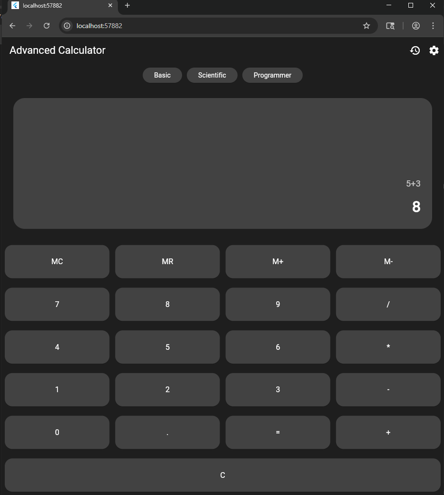
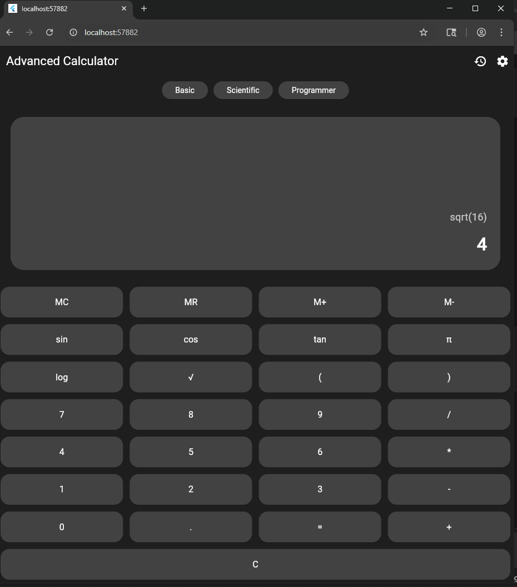
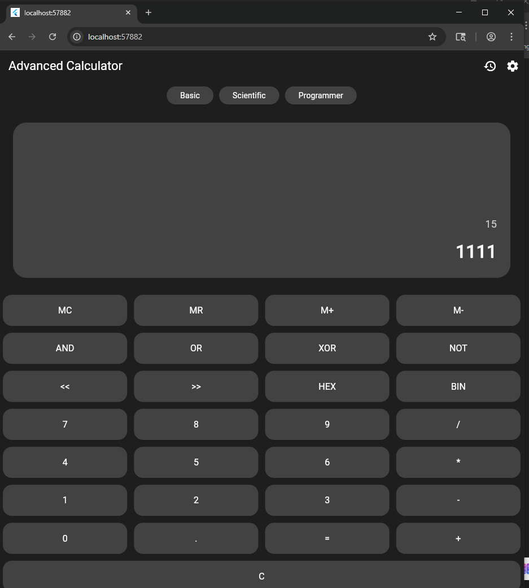
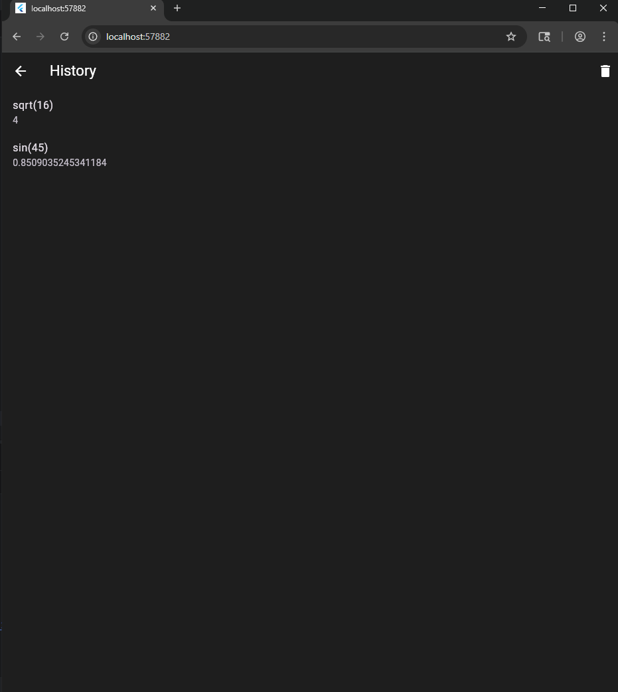
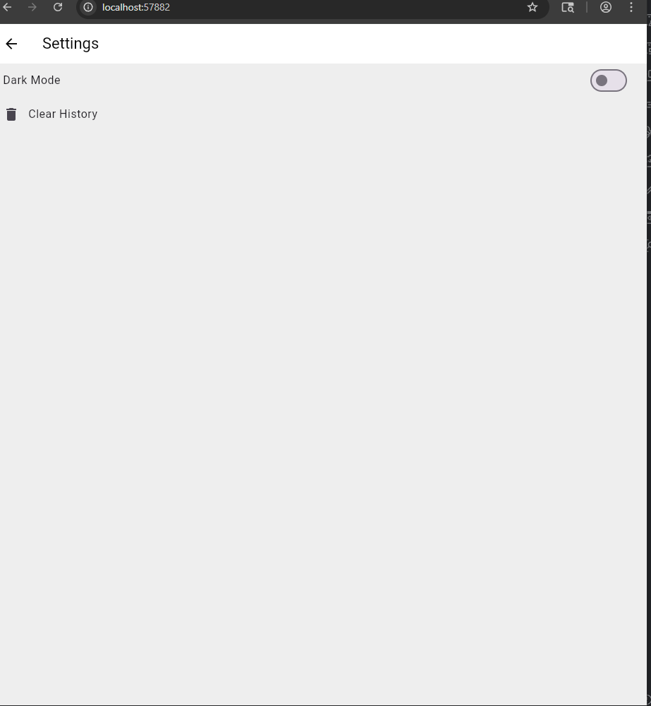
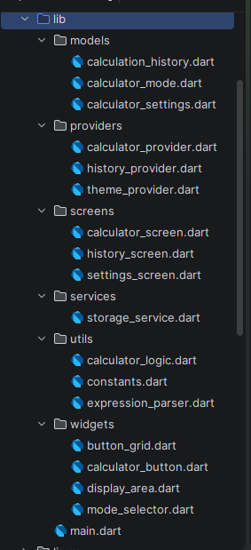

# 📱 Advanced Calculator - Flutter Lab 3

## 📌 Project Overview

**Advanced Calculator** là ứng dụng máy tính nâng cao được phát triển bằng **Flutter**, hỗ trợ nhiều chế độ tính toán khác nhau bao gồm:

- Basic Mode
- Scientific Mode
- Programmer Mode

Ứng dụng sử dụng **Provider** để quản lý trạng thái và **SharedPreferences** để lưu dữ liệu người dùng.

---

## 🎯 Objectives

Mục tiêu của project:

- Xây dựng ứng dụng Calculator đa chức năng
- Áp dụng mô hình **State Management (Provider)**
- Thực hiện **Local Storage (SharedPreferences)**
- Tạo giao diện người dùng hiện đại
- Hỗ trợ nhiều chế độ tính toán

---

## ⚙️ Features

### 🧮 1. Basic Mode

Chức năng:

- Addition (+)
- Subtraction (-)
- Multiplication (*)
- Division (/)
- Decimal calculation
- Clear (C)

Ví dụ:

---

### 🔬 2. Scientific Mode

Chức năng:

- sin()
- cos()
- tan()
- log()
- √ (square root)
- π (pi)
- Parentheses ( )

Ví dụ:

---

### 💻 3. Programmer Mode

Chức năng:

- Binary conversion (BIN)
- Hexadecimal conversion (HEX)
- Bitwise operators:
  Ví dụ:
- 15 → BIN → 1111
- 

---

### 🕒 4. History System

Chức năng:

- Lưu lịch sử phép tính
- Hiển thị danh sách lịch sử
- Lưu dữ liệu khi tắt ứng dụng
- Giới hạn tối đa **50 phép tính**

Công nghệ sử dụng:
SharedPreferences

---

### 🎨 5. Theme System

Chức năng:

- Dark Mode
- Light Mode
- Lưu trạng thái theme

Ví dụ:

---

## 🧱 Project Architecture

Ứng dụng sử dụng kiến trúc **Provider-based architecture**

## 🛠️ Technologies Used

Ngôn ngữ:
Dart
Flutter